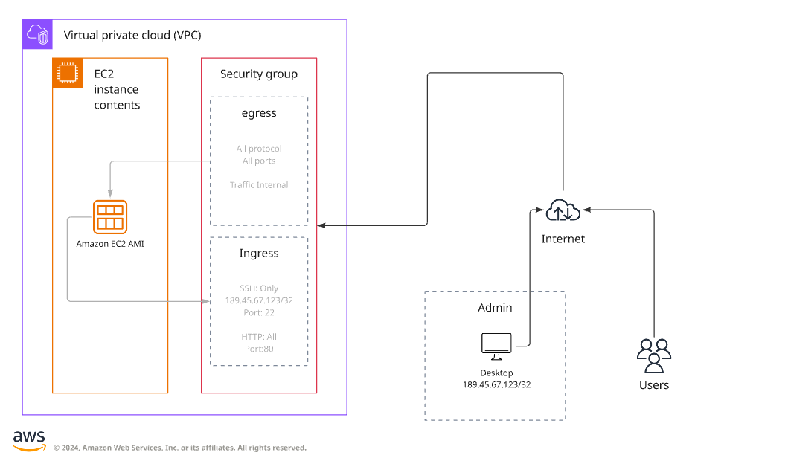

<h1 align="center">Provisionamento de uma VM simples na AWS (EC2) 👾</h1>

### Objetivos

- Criar uma instância EC2 com Ubuntu.
- Configurar security group para permitir SSH e HTTP.
- Output do IP público da VM.
 

### Diagrama do Projeto
  
  

      
  

### Passos iniciais

Devemos iniciar o projeto como o comando:

    terraform init
